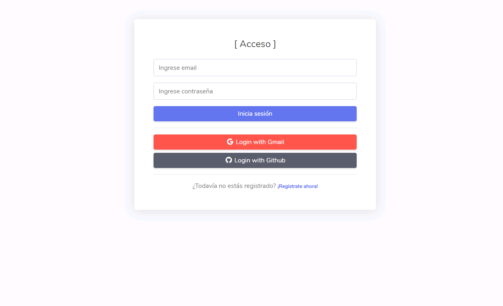

# Registro y Login con redes sociales

Registro y Login con redes sociales básico usando el sistema de autenticación de Firebase. Siguiendo el patrón de diseño MVC y PDO de PHP.

-------------------



## Contribución 

- Clonar con ```git clone https://github.com/herr-code/Registro-y-Login-con-redes-sociales.git```
- O descarga el zip


## Integrado

- **[CodeIgniter](https://github.com/Codeigniter-Template/Ruang-Admin-Template)** por Codeigniter Template
- **[Laravel](https://github.com/putralangkat97/ruang-admin-laravel-6)** por putralangkat97


## License

RuangAdmin is an open source and licensed under **[MIT](http://opensource.org/licenses/MIT)**


